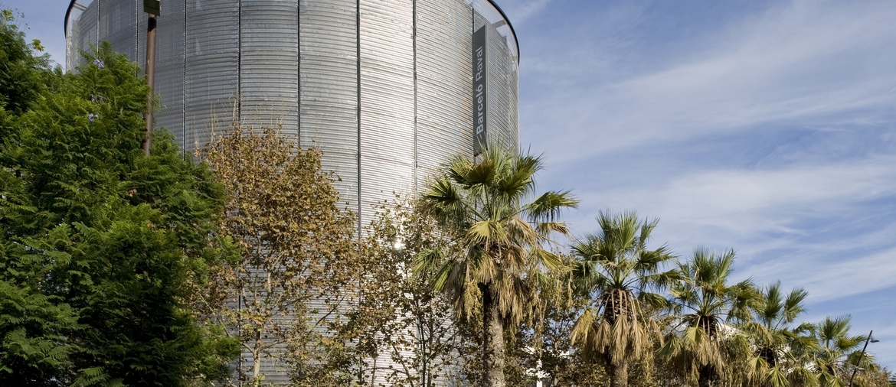
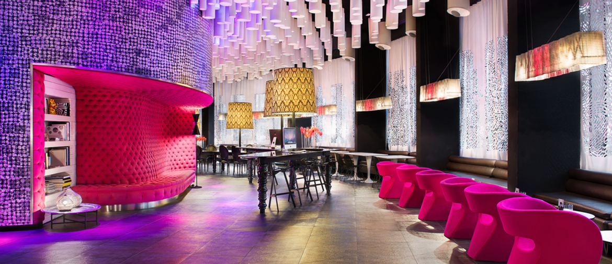
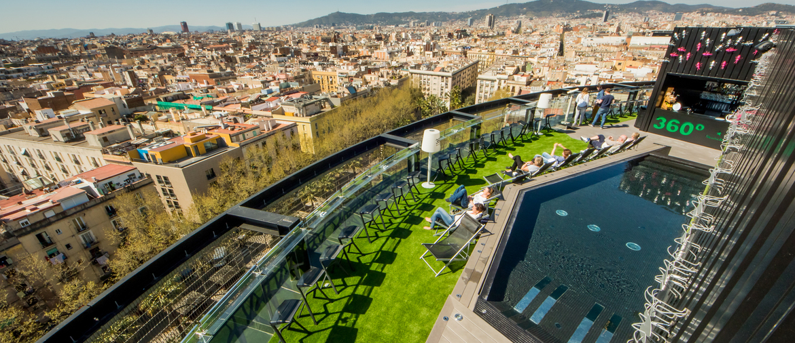

<head>
<link rel="stylesheet" href="https://cdnjs.cloudflare.com/ajax/libs/font-awesome/4.7.0/css/font-awesome.min.css">
</head>

  <h3>Hotel Barcelo Raval</h3>
  
**The Barceló Raval** strives to transmit the essence of this cosmopolitan Mediterranean city, given that it is on the doorstep of the lively Las Ramblas and very close to landmarks such as Plaza Catalonia, the Liceu theatre, the famous Boquería food market and the Cathedral. Its philosophy and cosmopolitan design connect with the city and make it one of the top hotels in Barcelona.

How to begin your discovery of the essence of urban Barcelona? Wake up in one of the hotel’s 182 rooms and 4 ultra-comfortable suites, with views of the district of Raval, all equipped with iPhone docking stations and with free Wi-Fi. 

When guests ask what makes the Barceló Raval stand out from other urban hotels in Barcelona, once they see the innovative lobby and admire the city's skyline from the marvellous panoramic 360° terrace, they know the answer. 

Among its amazing facilities, the hotel’s B-Lounge offers an amazing range of cuisine, including modern and creative tapas, coktails and one of the city's most famous brunches, served every Sunday. 

The entire hotel has been designed for you to connect with Barcelona; its gastronomy, culture and passion for everything avant-garde. Everything you need to experience a genuinely magical cosmopolitan city. Urban adrenaline runs through the veins of the Barceló Raval.

  

    
  

  

  
  

  

  
  

  

  
  

  

  

 

<section class="container">

<i class="fa fa-map-o" style="font-size:20px;color:orange;"></i> 
<b>Location:</b> City centre

<i class="fa fa-h-square" style="font-size:20px;color:orange;"></i> 
<b>Category:</b> 4 stars

<i class="fa fa-cutlery" style="font-size:20px;color:orange;"></i> 
<b>Restaurants:</b> 1 bar and restaurant

<i class="fa fa-wifi" style="font-size:20px;color:orange;"></i> 
<b>Free Wifi:</b> available in rooms and common areas

<i class="fa fa-coffee" style="font-size:20px;color:orange;"></i> 
<b>Meeting rooms:</b> 3 rooms : min 21 pax,max 70

<i class="fa fa-wheelchair" style="font-size:20px;color:orange;"></i> 
<b>Handicapped facilities:</b> Yes

<i class="fa fa-shower" style="font-size:20px;color:orange;"></i> 
<b>Outdoor swimmingpool:</b> no

<i class="fa fa-users" style="font-size:20px;color:orange;"></i> 
<b>Hotel Nr.of rooms:</b> 186

<i class="fa fa-clock-o" style="font-size:20px;color:orange;"></i> 
<b>Check in/out:</b> 2pm / check out by 12.00h

</section>

  

