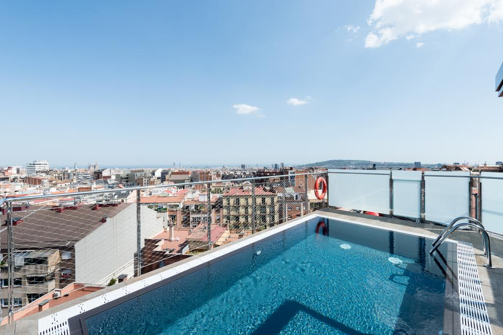
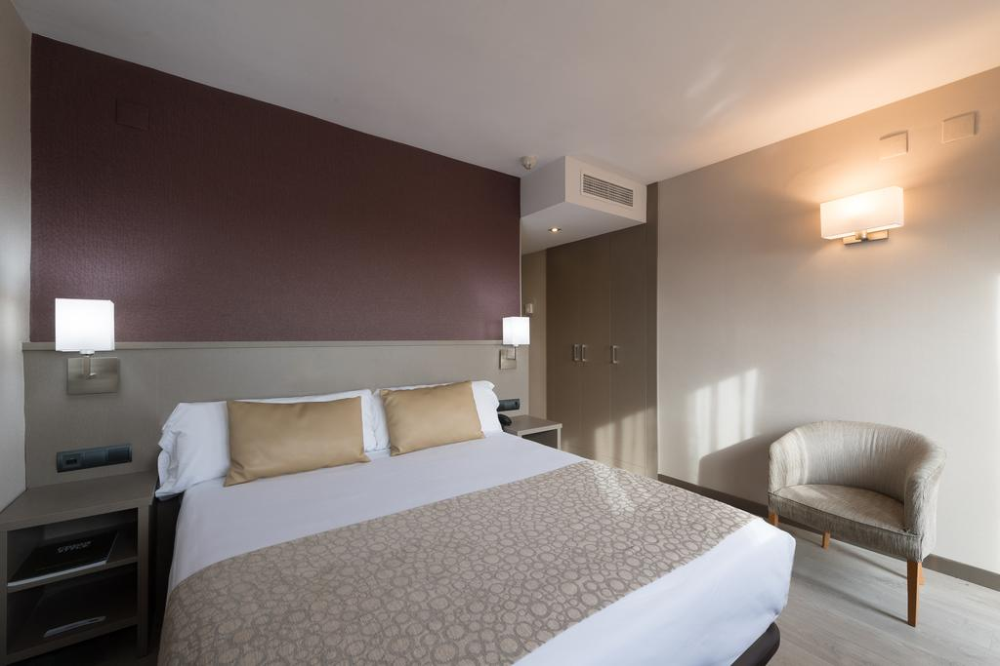
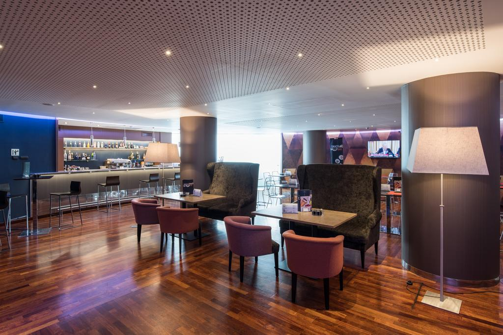

<head>
<link rel="stylesheet" href="https://cdnjs.cloudflare.com/ajax/libs/font-awesome/4.7.0/css/font-awesome.min.css">
</head>

  <h3>Hotel Catalonia Putxet</h3>
  
This luxury hotel is situated in the quiet neighbourhood of Putxet. The town centre is approximately 4 km from the hotel and can easily be reached by car. Various tourist sights including the famous Sagrada Familia and Güell park, both of which were designed by architect Antonio Gaudí, are located in the hotel's vicinity.
Featuring a sunroof terrace with a pool and views over Barcelona, Catalonia Park Putxet offers tranquil rooms and a modern fitness centre onsite. There is free WiFi available throughout.
The Park Putxet has simple, bright décor. Each air-conditioned room comes with a mini fridge with complimentary water, a satellite TV and a fully equipped bathroom with a hairdryer.

  

    
  

  

  
  

  

  
  

  

  
  

  

  

 

<section class="container">

<i class="fa fa-map-o" style="font-size:20px;color:orange;"></i> 
<b>Location:</b> City centre

<i class="fa fa-h-square" style="font-size:20px;color:orange;"></i> 
<b>Category:</b> 4 stars

<i class="fa fa-cutlery" style="font-size:20px;color:orange;"></i> 
<b>Restaurants:</b> 2 Restaurants and 1 bar

<i class="fa fa-wifi" style="font-size:20px;color:orange;"></i> 
<b>Free Wifi:</b> available in rooms and common areas

<i class="fa fa-coffee" style="font-size:20px;color:orange;"></i> 
<b>Meeting rooms:</b> 10 rooms= min 40 pax,max 200

<i class="fa fa-wheelchair" style="font-size:20px;color:orange;"></i> 
<b>Handicapped facilities:</b> Yes

<i class="fa fa-shower" style="font-size:20px;color:orange;"></i> 
<b>Outdoor swimmingpool:</b> Yes

<i class="fa fa-users" style="font-size:20px;color:orange;"></i> 
<b>Hotel Nr.of rooms:</b> 136 doubles/ 16 singles

<i class="fa fa-clock-o" style="font-size:20px;color:orange;"></i> 
<b>Check in/out:</b> 2pm / check out by 12.00h

</section>

  

