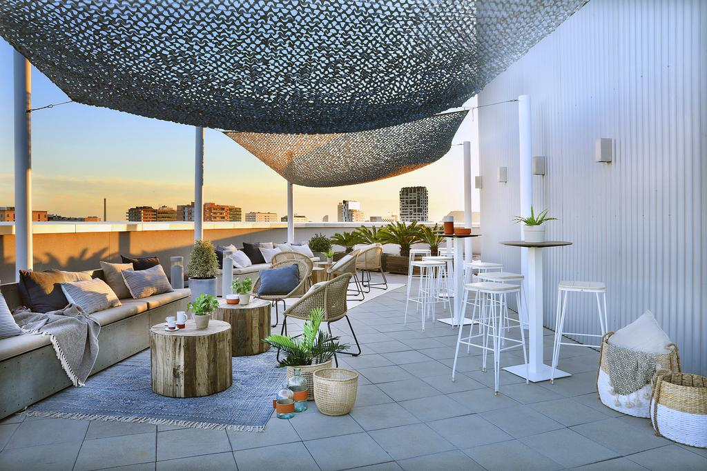
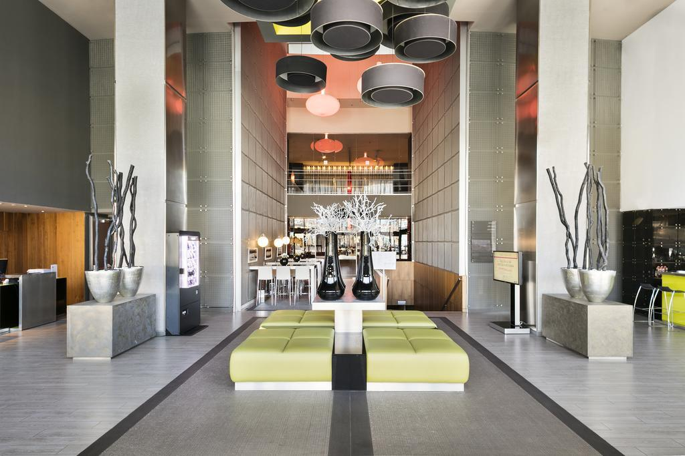
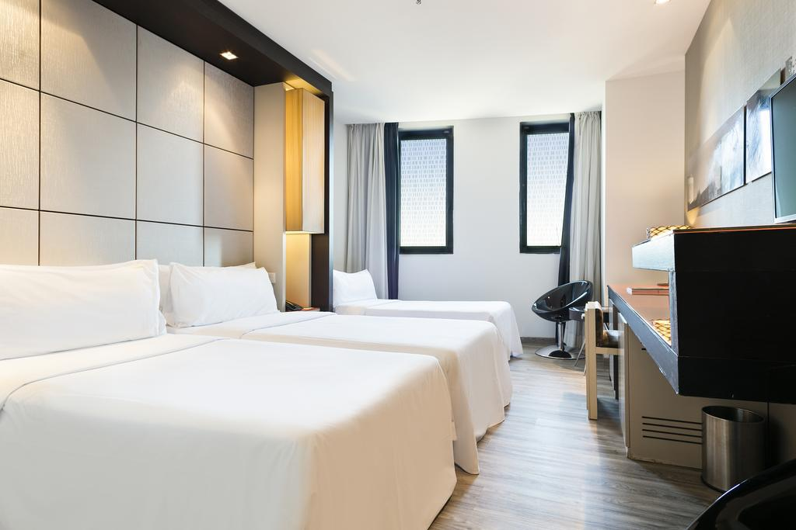

<head>
<link rel="stylesheet" href="https://cdnjs.cloudflare.com/ajax/libs/font-awesome/4.7.0/css/font-awesome.min.css">
</head>

  <h3>Hotel Tryp Condal Mar</h3>
  
The hotel boasts a convenient location in Barcelona close to Selva de Mar underground station. The vicinity of an underground station let you explore Bcn Bar and Casa Batllo with no difficulty.

Welcoming guests with a roof-top pool, a seasonal outdoor pool and a sun deck, the property is placed next to bars and restaurants.

Economy shared bathroom shared bathroom twin room, dormitory room and premium double room have chic décor along with coffee/tea makers, a personal computer, a pantry, ironing facilities and a sofa. Rooms offer a panoramic view over the city. They also have en suite bathrooms with a shower, a hairdryer and free toiletries.

Creative Mediterranean specialties are proposed at the small restaurant. Guests can unwind in the on-site poolside bar with a favourite drink. A huge variety of dishes is served in Raco del Taulat and Sant Marti, which are 5 minutes’ walk away.

  

    
  

  

  
  

  

  
  

  

  
  

  

  

 

<section class="container">

<i class="fa fa-map-o" style="font-size:20px;color:orange;"></i> 
<b>Location:</b> City centre

<i class="fa fa-h-square" style="font-size:20px;color:orange;"></i> 
<b>Category:</b> 4 stars

<i class="fa fa-cutlery" style="font-size:20px;color:orange;"></i> 
<b>Restaurants:</b> 1 lobby and 1 pool bar

<i class="fa fa-wifi" style="font-size:20px;color:orange;"></i> 
<b>Free Wifi:</b> available in rooms and common areas

<i class="fa fa-coffee" style="font-size:20px;color:orange;"></i> 
<b>Meeting rooms:</b> 4 room max 250

<i class="fa fa-wheelchair" style="font-size:20px;color:orange;"></i> 
<b>Handicapped facilities:</b> Yes

<i class="fa fa-shower" style="font-size:20px;color:orange;"></i> 
<b>Outdoor swimmingpool:</b> Yes

<i class="fa fa-users" style="font-size:20px;color:orange;"></i> 
<b>Hotel Nr.of rooms:</b> 178

<i class="fa fa-clock-o" style="font-size:20px;color:orange;"></i> 
<b>Check in/out:</b> 2pm / check out by 12.00h

</section>

  

